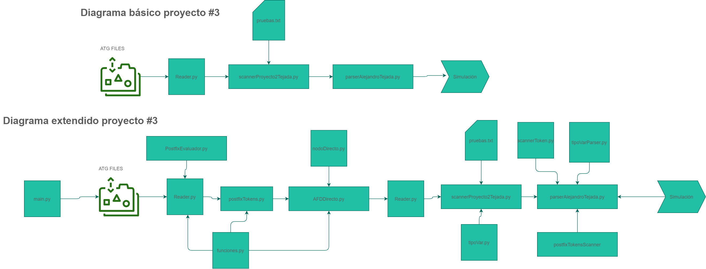

<h1 align="center">
<br>
   
<br>
<br>
Generador Analizador Sintáctico
</h1>
    
<p align="center">
  
  <a href="https://opensource.org/licenses/MIT">
    " alt="No license">
  </a>
</p>

<p align="center">University Project :mortar_board:</p>
<p align="center">Alejandro Tejada 17584</p>
<p align="center">Diseño Lenguajes de Programación</p>
<p align="center">Universidad del Valle de Guatemala</p>
<p align="center">31/05/2021</p>
<hr />

# Acerca de...

Este proyecto continúa el proyecto #1  y el proyecto #2. Usa los algoritmos de autómatas para generar un analizador léxico. El propósito es leer archivos de gramática, generar un scanner y simular la lectura de un archivo de prueba.  Luego, a partir de los tokens que el scanner lea, construir un parser que tome esos tokens y luego se comporte como un analizador sintáctico. 
Algunos puntos que se tocan en este proyecto:
- Lectura de archivo de gramática ATG
- Generación de Autómata finito determinista en base a los tokens del archivo de gramática
- Simulacion y creación de un Scanner que detecte tokens basado en un archivo de pruebas
- Creación de un Parser que lea producciones en la gramática del ATG y las convierta a un árbol, que a su vez escribe las funciones necesarias. 

# Descripción de herramientas  y archivos archivos

## Listado de herramientas usadas para el proyecto

- Python 3.8.0 64bits
- Compiladores principios, técnicas y herramientas, 2da Edición - Alfred V. Aho
- VS Code
- Windows Terminal
- A lot of Coffe (more Coffe than last time) (**enought coffe for a life V3**)


## Liberías NECESARIAS para correr el programa

- Python 3.8.0
  - Una versión de Python de la versión Python 3.6.0 64bits o mayor
- Graphviz
  - Graphviz es una librería que permite graficar los nodos. Instalarla si no se posee. Descargar la version necesaria en el [link de descarga](https://graphviz.org/download/)
- Pprint
  - Una librería de python para imprimir bonito. Si no se tiene instalar en https://pypi.org/project/pprintpp/
- Terminal
  - Una terminal o programa para correr los programas de python. Puede ser VS Code también.


## Archivos y carpetas
| No. | Archivo | Propósito/Descripción |
| --- | --- | --- |
| 1 | `ATGFilesExamples` |Es donde estan los archivos ATG que poseen la gramática|
| 2 | `Proyecto_#3.pdf` |La iniciativa del proyecto|
| 3 |`AFNDirecto.py`  |Contiene el código para el algoritmo de conversión directa|
| 4 | `documentacionExterna` |Contiene la documentación externa de Cocol|
| 5 | `rubrica_proyecto_3.pdf` |Rúbrica del proyecto 3|
| 6 | `funciones.py` |Son funciones generales para TODOS los algoritmos|
| 7 | `main.py` |El programa principal, este genera el scanner|
| 8 | `NodoDirecto.py` |Es la clase Nodo del algoritmo del conversión directa|
| 10 | `PostfixEvaluador.py` |Toma la expresión regular y hace el postfix, también opera el valor de los characters|
| 11 | `postFixTokens.py` |Ordena de forma de postfix el resultado de la expresión regular de la lectura de tokens|
| 12 | `reader.py` |Es el programa que lee el ATG, el archivo de gramática, y luego genera las expresiones regulares|
| 13 | `tipoVar.py` |Una clase que posee los atributos de cada tipo de token|
| 13 | `tipoVarParser.py` |Una clase que posee los atributos para hacer objetos de cada valor de produccion|
| 12 | `scannerToken.py` |Una clase que guarda en objetos cada token que el Scanner lee|
| 15 | `arrayTokensLeidos` |Es el diccionario que contiene TODOS los tokens leidos|
| 14 | `scannerProyecto2Tejada.py` |Es el Scanner generado|
| 15 | `postfixtokensScanner.py` |Un postfix que funciona como representacion del arbol, toma los objetos de la produccion y lo pasa a postfix|
| 15 | `parserAlejandroTejada.py` |Es EL PARSER YEII!|
| 15 | `diccionarioEstadosAceptacion` |Es el diccionario con los estados de aceptación|
| 16 | `diccionarioSiguientePos` |Es el diccionario de la siguiente posición|
| 17 | `dicionarioAFDFinal` |Es el AFD final|
| 18 | `pruebas.txt` |Es el file de pruebas|
| 19 | `Readme.md` |El readme|

<br>
<br>

## Link Youtube
### En el video se explica TODO el funcionamiento y más ejemplos.

<br>
<br>

## Diagrama del proyecto


## Cómo correr el proyecto

- Primero se debe editar en el file de `pruebas.txt` la operacion que se desea colocar. Este proyecto hace uso del EXPR.ATG, que en esencia tiene CUATRO operaciones basicas. Entonces, en el archivo de pruebas se coloca la operacion. Por ejemplo
  ```text
  1055*5;
  ```
- Luego, una vez hecho esto, se deben SCANNEAR los tokens. Se debe correr primero el  programa `main.py` y ejecutarlo en una consola. 
- Luego debes de seleccionar una opciónn del menú
 ```python
                      Selecciona una opción
                              1 - Iniciar lectura y creacion de scanner
                              9 - salir
                      Ingresa un valor...
```
- El único metodo posible es el de generar el scanner haciendo la lectura de la gramática
```python
                      Selecciona una opción
                              1 - Iniciar lectura y creacion de scanner
                              9 - salir
                      Ingresa un valor... 1

                      Presione cualquier tecla
```
- La salida será la generacion de tres files: los dump de pickle que son los autómatas. Adicional, se generá el scanner llamado **scannerProyecto2Tejada.py**
- Luego, ir al scanner generado `scannerProyecto2Tejada.py` y correrlo. La salida sera un dump de los tokens hecho con pickle
```python
                ------------------SIMULACION TOKENS INICIADA-------------------
                'El token del valor ----> holo <---- es: ident'     
                TOKEN INVALIDO del valor: 
                
                'El token del valor ----> 66 <---- es: number'      
                TOKEN INVALIDO del valor: 
                
                'El token del valor ----> +150 <---- es: signnumber'
                'El token del valor ----> \n <---- es: whitetoken'  
                'El token del valor ----> 55 <--- es: number'       
                ---------------------------------------------------------------
```
- Una vez generado el Scanner y los tokens, es momento de usar el Parser. Para esto, vamos al programa `reader.py` y lo corremos. Esto generará el programa **parserAlejandroTejada.py**.
- Corremos el parser y este tomara los tokens leidos y ejecutará la operación. En este caso que usamos la operacion 1055*5; el resultado será:
 ```text
  El Resultado de la operacion es:  5275
  ```


## Creditos y Agradecimientos

Course teacher: Bidkar Pojoy

- https://graphviz.org/about/
- https://graphviz.org/documentation/
- https://www.tutorialspoint.com/c_standard_library/time_h.htm
- https://docs.python.org/3/library/time.html
- Compiladores principios, técnicas y herramientas, 2da Edición - Alfred V. Aho
- Compañeros de clase
- More Coffe


## Licence

Bajo la propia del desarrollador.
